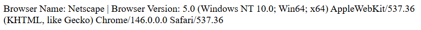
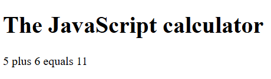

# JavaScript introduction - Exercises

## Exercise 1

When the page is opened, an alert box appears with the message “Welcome to this page.”

## Exercise 2

Declare and initialize the following variables:

```javascript
let number = 0;
let counter = 10;
let name = “Jan”;
let smaller = true;
let ok = false;
```

Perform the following operations:

```javascript
number += 10;
counter++;
number += counter;
number++;
smaller = (number < 20);
ok = (name != “jan”) && smaller;
```

- What are the results of the previous operations?
- Test this by displaying the results using the `document.write()` function.
- There must be **no HTML code in the body**.

## Exercise 3

- Ask the user for their last name and first name using separate prompt boxes.
- Then ask the user, via a confirm box, whether they are sure the name is spelled correctly.
- Look up how `confirm` works if necessary.

## Exercise 4

- Ask the user for 2 numbers using a prompt box.
- Calculate the:
  - Sum
  - Difference
  - Product
  - Quotient

- Display the results using `document.write`.

**Tip:**

The `prompt` function returns the entered value as a string. To convert a string to an integer, the `parseInt` or `parseFloat` function must be used. Pay attention to capitalization!

**Example:**

```javascript
input = prompt(“Enter a number”);
number = parseInt(input);
```

## Exercise 5

Determine the difference between the following two operations:

| Operation 1         | Operation 2         |
| ------------------- | ------------------- |
| number = 0;         | number = 0;         |
| counter = 10;       | counter = 10;       |
| number = counter++; | number = ++counter; |

## Exercise 6

- Using the standard `navigator` object, you can obtain information about the type of browser the user is using (which platform, which version, etc.).
- With `navigator.appName` you get a short version of the browser name.
- With `navigator.appVersion` you get a long version.
- Use these properties to write a script that displays the current browser version on the screen as shown in the image.
- Display this information in a `div`.



## Exercise 7

- Ask for two numbers and add them together.
- Keep in mind that `prompt` returns a string.


