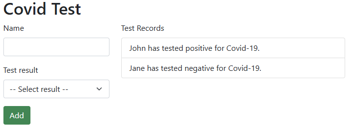
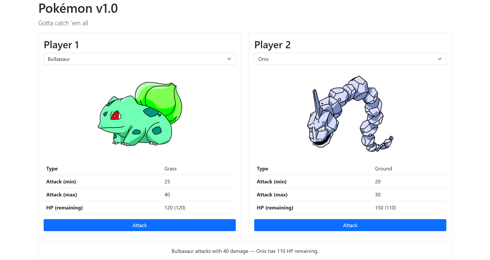
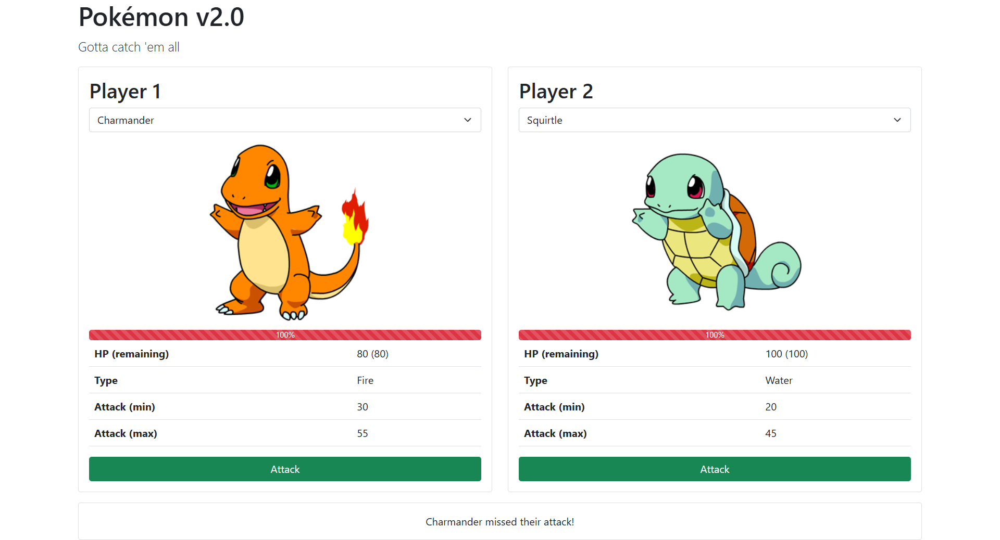
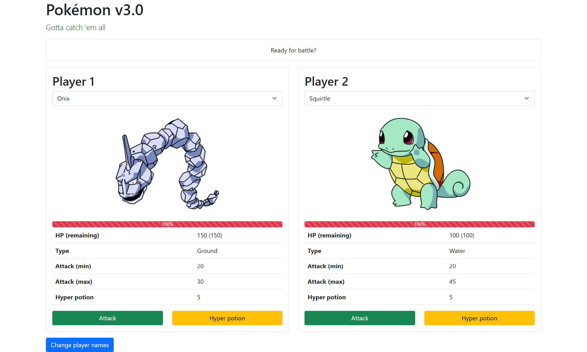
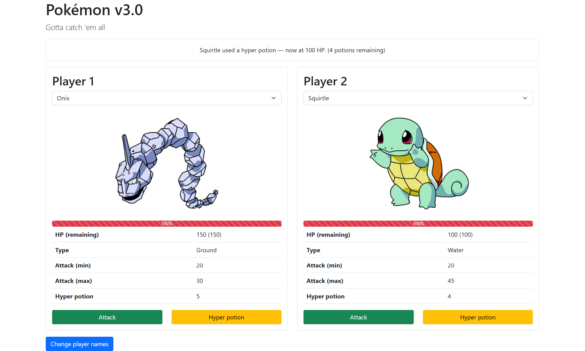
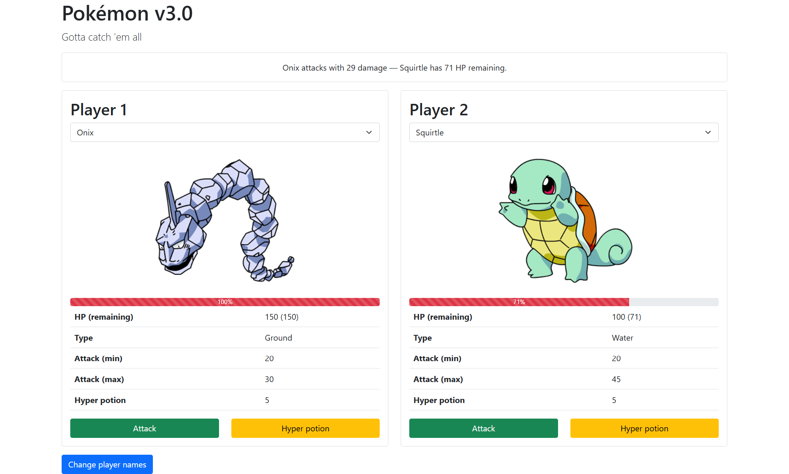
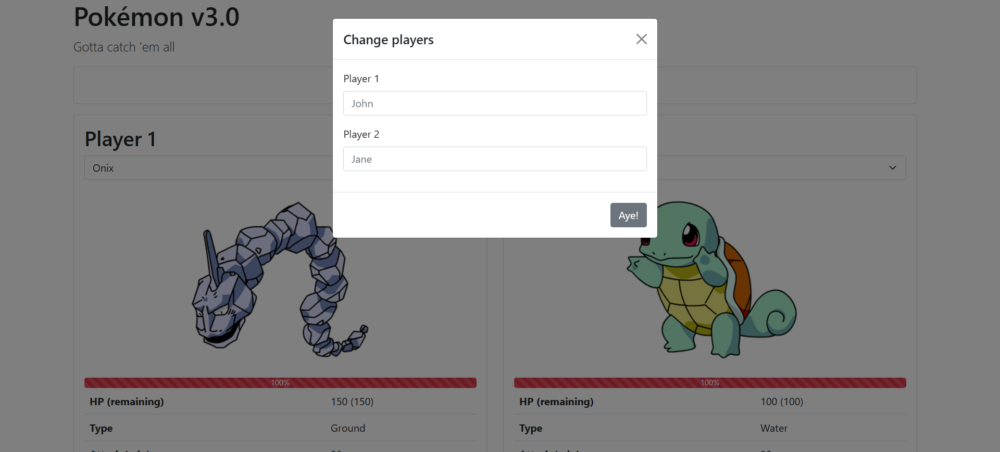
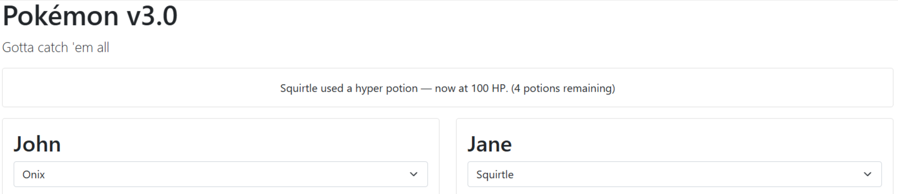

# JavaScript classes - Exercises

## Exercise 1

Create a class CovidTest with two properties: name and result. When the user enters a name and a result and clicks the Add button, the result will automatically appear in the list. The class also has a method called resultaat (result) that displays the following text depending on the test result.

The result when someone tests positive: $name has tested positive for Covid-19.
The result when someone tests negative: $name has tested negative for Covid-19.

You cannot add a result when the name is empty and/or when no choice has been made for Test result.



## Exercise 2

1. Data & Pokémon Class

Create a JavaScript class `Pokemon` with the following properties:

- `name` (string)
- `type` (string, e.g., "Water", "Fire")
- `attackMin` (integer, minimum damage)
- `attackMax` (integer, maximum damage)
- `hitpoints` (integer, starting/max HP)
- `image` (string, filename like "Squirtle.gif")

The class should also have:

- A method `attack()` that returns a random integer between `attackMin` and `attackMax` (inclusive).
- A method `hp()` that returns a string in the format `"hitpoints (currentHP)"`, e.g., `"100 (75)"`.

Each Pokémon instance must track its current HP separately from its base hitpoints. The base HP never changes, but currentHP decreases when damaged.

2. Initial Pokémon Arrays

Create two separate arrays: `player1Pokemon` and `player2Pokemon`.

Each array must contain at least 4 different Pokémon instances (you may use the same names/stats for both players).

Example data:

- Squirtle (Water, attack 20‑45, HP 100, image "Squirtle.gif")
- Bulbasaur (Grass, attack 25‑40, HP 120)
- Charmander (Fire, attack 30‑55, HP 80)
- Onix (Ground, attack 20‑30, HP 150)

3. HTML & Bootstrap 5 Layout

Use Bootstrap 5 (CSS + JS bundle) via CDN.

Structure:

- A responsive container with a heading and a lead paragraph.
- Two columns on medium screens and up (`col-md-6`), each containing a card.

Each card shows:

- Player title ("Player 1" / "Player 2")
- A `<select>` dropdown populated with Pokémon names from the corresponding array.
- An `` that initially displays `"img/pokeball.png"`.
- A table displaying: Type, Attack (min), Attack (max), HP (remaining) – initially `-`.
- An **Attack** button.

Below the two cards, a third card (full width) with an action info bar that shows the result of the most recent attack. Initially `"-"`.

4. Dropdown Population (Dynamic)

When the page loads, populate Player 1’s dropdown with options from `player1Pokemon`.

Each `<option>` value should be the array index.

The first option (disabled or selected by default) must be `"Choose your Pokémon"` with value `"-1"`.

Do the same for Player 2 using its own array.

Do not hardcode option tags in HTML – generate them with JavaScript.

5. Display Selected Pokémon

When a player selects a Pokémon from their dropdown:

- Update that player’s image `src` to `"img/" + pokemon.image`.
- Update the table cells: Type, attackMin, attackMax.
- Update the HP cell using `pokemon.hp()` (shows base and current).

If the placeholder `"-1"` is selected, do nothing (or reset to `-`).

6. Attack Logic

Clicking **Player 1’s Attack** button:

- Attacker = Player 1’s currently selected Pokémon.
- Defender = Player 2’s currently selected Pokémon.

Clicking **Player 2’s Attack** button does the opposite.

**Guard condition:** If the attacker’s `currentHP <= 0`, show an alert saying `"[Pokémon name] has fainted — you can't attack!"` and do not proceed with the attack.

Otherwise:

- Calculate damage using `attacker.attack()`.
- Subtract damage from `defender.currentHP`.
- Refresh the defender’s card (update HP display, and optionally any other stats – though they don’t change except HP).
- Update the action info bar with a message:
  - If defender’s `currentHP <= 0` after the attack:  
    `"[Attacker name] attacks with [damage] damage — [Defender name] has fainted!"`

  - Else:  
    `"[Attacker name] attacks with [damage] damage — [Defender name] has [currentHP] HP remaining."`

**Important:** After a Pokémon faints, its currentHP stays at 0 or below. It can no longer attack, but can still be attacked (no additional restriction needed in v1.0 – though you may prevent attacking a fainted defender if you wish, but the solution does not).



## Exercise 3

1. Pokémon Class

Same properties as before: name, type, attackMin, attackMax, hitpoints, image, currentHP.

**Methods:**

- `attack()` – new behaviour:  
  With 25% probability, return 0 (miss) and log a message to the console (optional but good).  
  Otherwise, return random damage between `attackMin` and `attackMax` (inclusive) as before.

- `hp()` – returns `"hitpoints (currentHP)"` (unchanged).

- New method: `hpPercent()` – returns currentHP as a percentage of base hitpoints, rounded to the nearest integer, clamped at 0 (cannot be negative).  
  Example: if `hitpoints = 100` and `currentHP = 73`, returns `73`. If `currentHP = -5`, returns `0`.

2. HTML & Bootstrap 5 – Add Progress Bar

Inside each Pokémon card, below the image and above the stats table, insert a Bootstrap progress component:

```html
<div class="progress">
  <div
    id="player1-progress"
    class="progress-bar progress-bar-striped progress-bar-animated bg-danger"
    role="progressbar"
    style="width: 100%"
    aria-valuemin="0"
    aria-valuemax="100"
  ></div>
</div>
```

The inner `<div>` must have a unique ID per player (e.g., `player1-progress`, `player2-progress`).

Initially, the width is `100%` because the Pokémon starts at full HP.

3. Update Logic – Progress Bar & HP Display

When a Pokémon is selected from the dropdown, or after an attack, the `updatePokemon()` function must:

- Update the image, type, attack min/max, and the HP text (same as v1).
- Update the progress bar:
  - Call `pokemon.hpPercent()` to get the percentage.
  - Set the progress bar’s `style.width` to `percent + '%'`.
  - Set the progress bar’s `textContent` to the percentage number (e.g., `"73%"`) only if `percent > 0`; otherwise leave it empty (`''`).
- The HP table cell still shows `"base (current)"`, e.g., `"100 (73)"`.

4. Attack Logic – Handle Misses

When an attack occurs:

- Calculate `damage = attacker.attack()` – may be `0` on a miss.
- Subtract damage from `defender.currentHP` (if damage is `0`, HP unchanged).
- Refresh the defender’s card (HP text + progress bar).
- Update the action info bar with different messages:
  - **Miss:** `"[Attacker name] missed their attack!"`
  - **Hit + defender faints:** `"[Attacker name] attacks with [damage] damage — [Defender name] has fainted!"`
  - **Hit + defender still alive:** `"[Attacker name] attacks with [damage] damage — [Defender name] has [currentHP] HP remaining."`

The guard condition remains: a fainted Pokémon (`currentHP <= 0`) cannot attack.

5. Data & Initialisation

Two separate arrays: `player1Pokemon` and `player2Pokemon`, each with at least 4 Pokémon (Squirtle, Bulbasaur, Charmander, Onix with same stats as v1).

Populate dropdowns dynamically from these arrays.

Default image: `"img/pokeball.png"`.

Assume `img/` folder contains the required `.gif` files.



## Exercise 4

1. Pokémon Class

Same properties and methods as v2: name, type, attackMin, attackMax, hitpoints, image, currentHP.

- `attack()` – 25% miss chance (returns 0 on miss, else random damage).
- `hp()` – returns `"hitpoints (currentHP)"`.
- `hpPercent()` – returns percentage clamped at 0.

New method: `hyperPotion()` – restores 50 HP to currentHP, but cannot exceed hitpoints (base max).

Example: if `currentHP = 70` and `hitpoints = 100`, after potion `currentHP = 100` (not 120).  
If `currentHP = 95`, after potion `currentHP = 100`.

2. Player State – Track Potions Separately

Create an object (or two variables) to store per‑player data:

- `name` – display name (default `"Player 1"`, `"Player 2"`).
- `potions` – number of hyper potions remaining (starts at 5).

Why separate? Potions belong to the player, not to a specific Pokémon. If the player switches Pokémon, the potion count remains the same.

3. HTML & Bootstrap – Add Potion UI + Modal

In each player’s table, add a new row:

```html
<tr>
  <th>Hyper potion</th>
  <td id="player1-hyperpotion">5</td>
</tr>
```

Replace the single Attack button with a two‑button row (using Bootstrap grid):

- Attack button (green, `btn-success`)
- Hyper potion button (yellow/orange, `btn-warning`)

Add a “Change player names” button (anywhere, e.g., below the cards) that triggers a Bootstrap modal.

Create a Bootstrap modal (`#playerNamesModal`) containing:

- Two text inputs with labels “Player 1” and “Player 2”.
- A submit button (e.g., “Aye!”) that reads the inputs and updates the card headers (`<h2 id="player1-name">` etc.).

The modal must be functional via Bootstrap’s JS bundle (data attributes or manual JS).

4. Healing Logic – `healPokemon()` function

When a player clicks their **Hyper potion** button:

- **Guard 1:** No Pokémon selected (dropdown value = -1) → do nothing (or log/alert).
- **Guard 2:** Selected Pokémon has `currentHP <= 0` (fainted) → show message in action info bar: `"[Pokémon name] has fainted — hyper potion cannot be used!"`
- **Guard 3:** Player has potions `<= 0` → show message: `"[Player name] is out of hyper potions!"`

If all guards pass:

- Call `pokemon.hyperPotion()` (restores 50 HP, capped at base).
- Decrease player’s potion count by 1.
- Update the potion counter in the table (`textContent`).
- Refresh the Pokémon card (HP text, progress bar) using `updatePokemon()`.
- Set action info bar message:  
  `"[Pokémon name] used a hyper potion — now at [currentHP] HP. (X potions remaining)"`  
  (with correct pluralisation “potion” / “potions”).

5. Attack Logic – Minor Improvement

In v3 solution, after subtracting damage, `defender.currentHP` is clamped to 0 (never negative).  
Implement: `if (defender.currentHP < 0) defender.currentHP = 0;`  
This keeps HP display clean and avoids negative percentages.

6. Player Name Modal – Implementation Details

- The modal can be triggered via a link/button with `data-bs-toggle="modal" data-bs-target="#playerNamesModal"` (Bootstrap 5).
- Inside the modal, inputs have ids like `player1-fullname`, `player2-fullname`.
- Submit button has an id (e.g., `changePlayerNames`) – add a click event listener that:
  - Reads `.value.trim()` from each input.
  - If non‑empty, updates the corresponding `playerState.name` and the card’s `<h2>` `textContent`.
- The modal closes automatically if the button has `data-bs-dismiss="modal"`.
- If an input is empty, leave the current name unchanged.

7. Data & Initialisation

- Two Pokémon arrays (identical or different – solution uses same four Pokémon).
- Dropdowns populated dynamically.
- Default image `"img/pokeball.png"`.
- Progress bar width 100% initially.
- Potion counters start at 5 and are displayed in the table.










