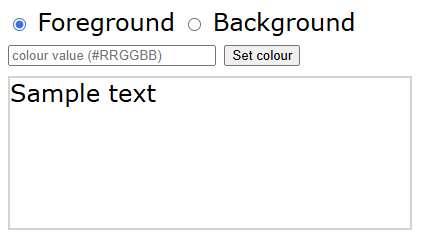
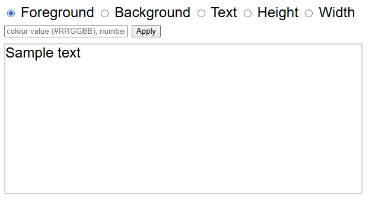
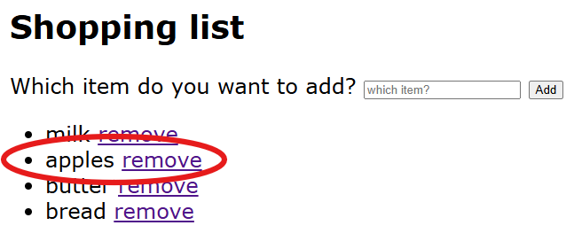
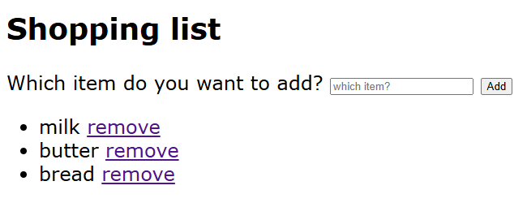

# JavaScript jQuery HTML and CSS - Exercises

## Exercise 1

Write a page with a text field, a button and a div. In the text field, the visitor can enter a hexadecimal colour value (#45A966). After clicking the button, the div gets this colour value as its background colour.

- Optionally extend the page with a second text field and a button. In this, the visitor can set the foreground colour.
  - Extension: check the entered value.
- Modify the page so that one text field is sufficient. With radio buttons, you can set whether the foreground or background colour is adjusted. A click on the button shows the preview in the div.

## Exercise 2

Adapt the previous exercise/page. Add an extra radio button on the page. This allows the visitor to enter text (instead of a colour value) in the text field. If this radio button is selected, the text is placed in the div – replacing the text “Example text”.

- Extend this script so that the newly entered text is added to the current text, instead of replacing the text.
  - Tip: first save the current text in a helper variable and combine it with the new text.
- Add a button to clear the text field.
- Place two more radio buttons on the page. The choices here are Height and Width. If these are selected, the visitor can enter a pixel value in the text field. After clicking the button, the div gets this value.
- Ensure that the text field is cleared when clicked into it.

## Exercise 3

Create a table with a text field and a button. Each time the button is clicked, the text is added as a list item (`<li>`) to a list (`<ul>`).

- Extend the page with an extra button. When clicked, the oldest text on the page is removed.
- Extension: ensure that a Remove hyperlink appears after each list item. When clicked, the item itself is removed.
  - Tip: use the option to provide a context for the `.on()` function. The notation then becomes something like
    `$(‘myList’).on(‘click’, ‘.className’, function() {...});`
    See: [api.jquery.com/on/](http://api.jquery.com/on/)

