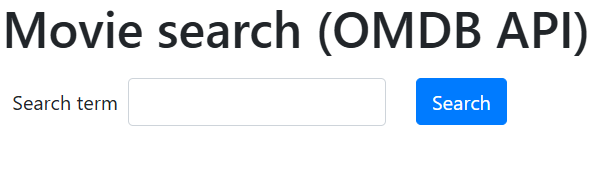
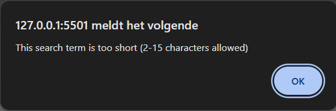
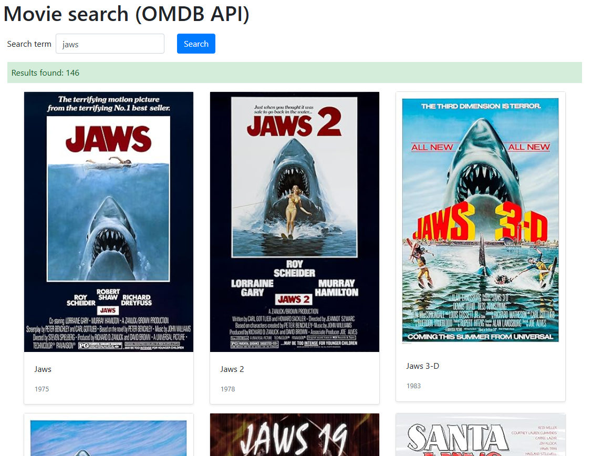
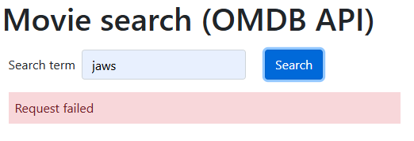
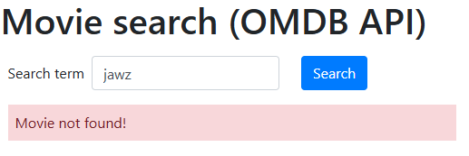
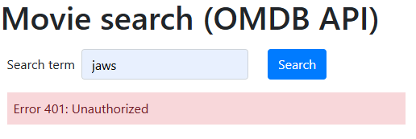

# JavaScript JSON Objects & XHR - Exercises

## Exercise 1

Create a web application that allows you to search for and display movies (of type MOVIE) in the OMDB API. Visit the website (omdbapi.com) and review the information you need as a developer.  
Make sure you have an account as described in the document JS API accounts on Canvas.

Use the URL below:  
`http://www.omdbapi.com/?s=<< search term >>&type=movie&apikey=<< myAPIkey >>`

The user enters a search term that must consist of at least 2 characters and can consist of at most 15 characters. Display an appropriate error message!

When a correct search word is entered, you will obtain a JSON result with movies.

Display these using Bootstrap Cards. Use the fields Poster, Title and Year.  
The number of results is shown in a green div.  
The API returns a maximum of 10 results per page.

Ensure that you catch the error messages below.

E.g., URL incorrect => `http://www.omdbapi.com/?`

E.g., searching for “jawz”

E.g., not providing an api-key parameter

Simulate the different types of errors:

- A request that is erroneous
  - For example: incorrect URL
- A request that is correct but returns an error
  - For example: we forget to provide an API key
- A request that is correct but found no movies
  - For example: entering “jawz”

If there are still results from the previous search, ensure they are no longer shown when an error occurs.

Build this exercise using the following structure:

- When clicking the “search” button => anonymous function via an event listener.  
  In it, do:
  - Disable the “normal form behaviour” (submit) via preventDefault.
  - Call the `validateSearch` function
  - If the validation is successful, request the request via the function `myRequest`

- Function `validateSearch`
  - This function checks whether the search term is valid => 2 – 15 characters and optionally gives an error message
  - This function returns a boolean indicating whether the validation was successful or not

- Function `myRequest`
  - This function makes the request and displays any error messages
  - If the request is successful, the number is shown and the movies are displayed via the function `renderMovies`

- Function `renderMovies`
  - For each object in the Search array that you received via the JSON result, create a Bootstrap column (md-4 and sm-6) containing the Card and the necessary fields Poster, Title and Year.

## Exercise 2

Build a single‑page application that fetches a JSON file (`mayors.json`) from a local `json/` folder, parses the data, and displays it in a Bootstrap‑styled table. The page must show the title (name) and version from the JSON, and render each mayor’s name, vaccine type, vaccination status (as “Yes”/“No”), and date.

- Use the given HTML – do not change element IDs (`#name`, `#version`, `#resultTable`, `#divResult`).
- Bootstrap 5 CSS and JS bundles are already linked.
- The table `<tbody id="resultTable">` already contains the header row (`<th>` elements). Do not duplicate the header when appending data rows.

### Fetch JSON Data

- Use `XMLHttpRequest` (not `fetch` – the solution uses XHR, so the exercise should require XHR).
- The JSON file is located at `json/mayors.json` (relative path).
- On page load, initiate the request automatically (no button click).

Handle the following:

- **Success (HTTP 200):** Parse the JSON response and update the DOM.
- **HTTP error (status ≠ 200):** Display the error message inside the `
` as plain text (e.g., `"404: Not Found"`). Do not use `innerHTML` for this – use `textContent`.
- **Network error** (e.g., file not found, CORS, offline): Show an alert with the error message (`xhr.responseText` or a generic message).

### Parse JSON

- Parse the JSON response using `JSON.parse()`.
- Extract the following top‑level properties:
  - `name` – set as the text content of `<h1 id="name">`.
  - `version` – set as the text content of ``.
  - `list` – an array of mayor objects.
- For each mayor object in `list`, append a new row (`<td>`) to `<tbody id="resultTable">`. Each row must contain four cells (`<td>`) in this order:
  1. Mayor’s name
  2. Vaccine type (e.g., “Pfizer”, “Moderna”, “AstraZeneca”)
  3. Vaccination status – if `vaccinated` is `true`, display `"Yes"`; if `false`, display `"No"`.
  4. `date` – display as given (string in `YYYY/MM/DD` format). No date conversion needed (the solution includes a commented option for Date conversion, but the final output uses the raw string).

- Do not use `innerHTML` on the entire table body – instead, use `document.createElement('tr')` and either `innerHTML` on the row or individual `createElement('td')`. The solution uses `tr.innerHTML = ...` which is acceptable for this exercise.
- Do not clear and re‑append the header row – the header `<th>` elements are already inside `<tbody>`. Append new rows after them.
- If the JSON contains 4 mayors, the table must show exactly 4 data rows (plus the header row).

### Error Handling

- If the JSON file is missing or the path is wrong, the `onerror` callback triggers an alert.
- If the HTTP status is not 200, show the error in `#divResult` (overwriting any previous content). Do not append table rows.
- Assume the JSON structure is always valid when status is 200 (no need to validate missing fields, but the code should not break if a field is missing – the solution assumes correct data).

### Code Quality & Modern JavaScript

- Use arrow functions at least once (e.g., in `forEach` or event handlers).
- Separate concerns: a `request()` function that fetches and parses, and an `append_table(data)` function that renders rows.
- Do not use `fetch()` – the exercise specifically trains `XMLHttpRequest`.
