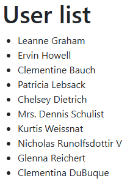
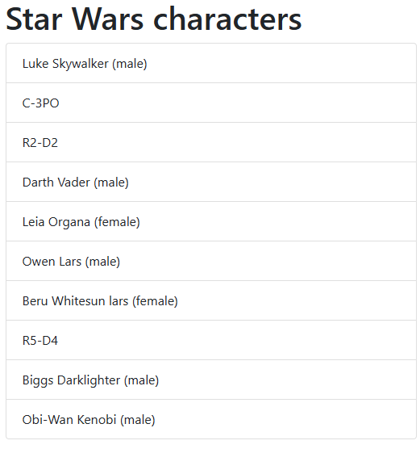

# JavaScript API & Promise - Exercises

## Exercise 1

Create a web application that accesses the fake JSONPlaceholder API and displays a list of the users. Populate the pre-existing ul list (list) with list items.



## Exercise 2

Create a web application that displays the characters (https://swapi.info/api/people/) from Star Wars in a Bootstrap “List group”. Showing only the first page (10) is sufficient.

Populate the pre-existing ul list (starWarsPeopleList) with list items.

After the name, display the gender. If it is not male/female, then display nothing.



Provide error handling when we change the URL to, for example, “https://swapi.info/api/peooooople/”. Display the error message in the div “divErr”.


Use `https://swapi.info` to access the API. Work with `fetch` and Promise.

## Exercise 3

Create a web application that fetches (random) images from unsplash.com. Retrieve a list of 25 images. Look up the URL via `https://picsum.photos`. We only show landscape images!

Use the spinner in the starting file.


- When the DOM is loaded, perform the following:
  - Show the spinner
  - Call the asynchronous function `makeRequest`
  - Call the function `makeGall`
  - Hide the spinner
    - Note: the spinner disappears when the HTML code from `makeGall` is loaded into the DOM. The (large) images still need to come through!
- Function `makeRequest`
  - This function returns the result of the `fetch`
  - Convert the response to json
  - Use the `.filter` function to keep only landscape images in the array
- Function `makeGall`
  - This function builds the HTML code based on the result array
  - Use a `col-md-4` and the HTML code for a card with an image
  - Try to replicate the view below as closely as possible
  - Use the author, url, height & width and for more info the download_url


Optionally, add a delay via a `fakeTimeOut` function of, for example, 3 seconds.

```javascript
await fakeTimeOut(3000); // Call this function (as the first thing) in the makeRequest function.

fakeTimeOut = (ms) => {
  return new Promise((resolve) => setTimeout(resolve, ms));
};
```
