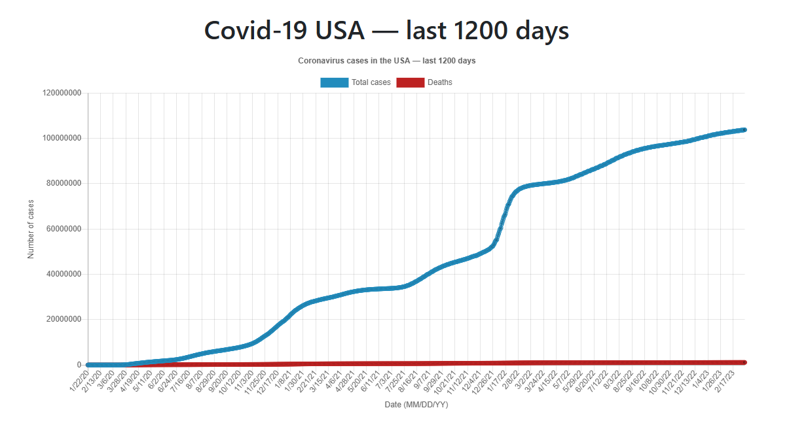
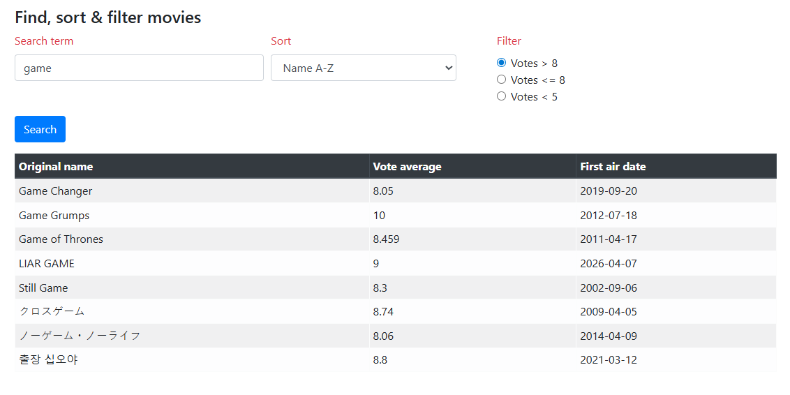

# JavaScript repetition exercises

## Exercise 1

Use the OpenWeatherMap API

- Request the coordinates of your current location via the Geolocation API
- https://developer.mozilla.org/en-US/docs/Web/API/Geolocation_API
- Request the data via the Fetch API and display the correct data in the provided fields

## Exercise 2

- Use data from disease.sh – Open Disease Data
  - Use `GET /v3/covid-19/historical/{country}`
  - We request the data of the last 1200 days for the USA
- Use the Line chart from chartjs.org
- Request the data via the Fetch API
- Use `async` and `await` to retrieve all the data before passing it to the chart

## Exercise 3

- Use data from api.themoviedb.org
  - Use `GET /3/search/tv?api_key={api-key}&language=nl-BE&query={search}`
- Use a function `getData` to fetch the data via the Fetch API
  - At least two characters must be entered
- Use a function `showData` to further build the table with data
  - Remove all results where votes = 0
  - Call the functions `sortData` and `filterData`
- The function `sortData` sorts the data based on a choice
  - Retrieve the value based on the selection in the list
  - It is structured as `name_field#az` or `name_field#za`
  - Sort the data
- The function `filterData` filters the data based on a choice
  - Based on the selected radio button, filter out the correct data based on the `vote_average` field

