# JavaScript exam examples

## Exercise 1

Develop an application that allows adding athletes and their medals to a list. It should also be possible to delete an athlete and a medal.

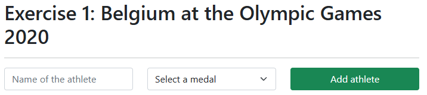

### Clicking the + button – validation

When clicking the “Add athlete” button, start an anonymous arrow function. Ensure validation that an athlete and a medal are always entered. The number of characters for the athlete's name does not matter.

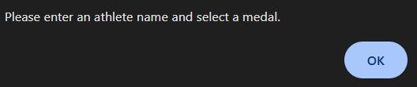

### Adding to the list

Populate the pre-existing unordered list with a list item when clicking the green button. The list item consists of a combination of the name from the text field and the position from the select list. Also give this list item a class name.

### Deleting a list item

Ensure that if we click on a list item, for example “Wout van Aert – bronze”, this item disappears from the list. This can be done without any message.

After clicking on “Wout van Aert – bronze”

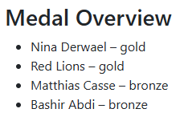

## Exercise 2

Create an application that uses the JSON file “json/athletes_og_output.json”.

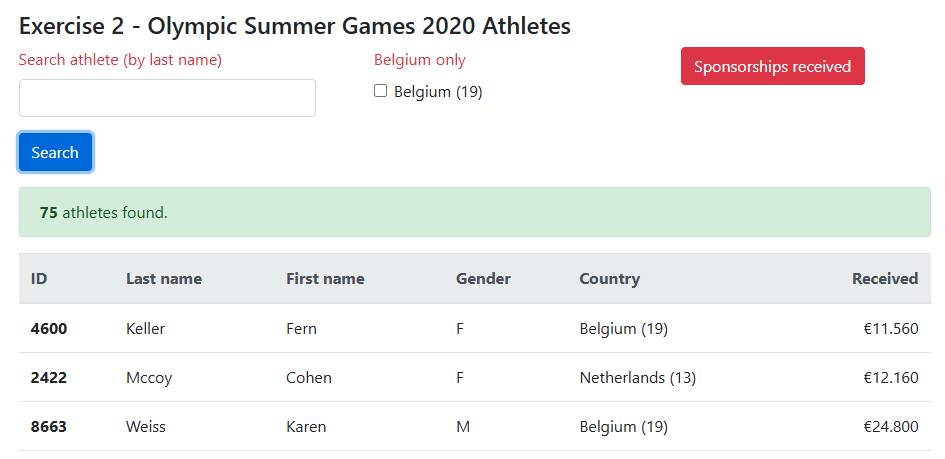

### Events

Link 3 events to the following elements:

- When clicking the “search” button, call the `getData` procedure
- When changing the checkbox, call the `getData` procedure
- When clicking the “outstanding sponsorships” button, call the `receiveSponsors` procedure

### Global

Declare here the elements you wish to target. Always work via `querySelector`.  
You will add to this as you build this application.  
Also prepare an array we will work with: `workingData`  
Also store the filename of the JSON file here.

### Function `getData`

When we click the search button, the data must be retrieved via the fetch API.

- Ensure that the default action of submitting the form is not executed.
- If the response is successful, return it as a JSON object; otherwise, display an error message in the console.  
  For example, with a wrong filename: “Seems there is a problem... Status code: 404”
- Capture the data and store it in the `workingData` array
  - Copy the (array) data you receive to `workingData` (look this up if needed => clone array JavaScript!)
  - Call the `searchAthletes` function here.
- If something goes wrong in the fetch method, catch it and display an error message in the console with the error code & error message.

### Function `searchAthletes`

Here we check whether the user has entered anything in the “search” text field.  
If so, we will filter the `workingData` array for occurrences of the search value anywhere in the last name.

Then call the `showData` function.

Caution: always compare the last name and the search value in lowercase.  
So with “Kel” it will find “Keller Fern”.  
With search value “ER” it will find 17 athletes.

### Function `showData`

Make the div showing the number of athletes found visible.  
Also remove any previous data from the table body.

We call the `filterAthletes` function here. This checks whether the checkbox is ticked and captures the return in the `workingData` array. More about this in the `filterAthletes` section.

Now check whether there is data in the `workingData` array.  
Display the following messages in an appropriate manner.

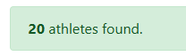

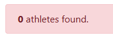

Populate the table body with rows containing the data from the `workingData` array.  
Use the following data: `id`, `athlete.person.lastName`, `athlete.person.firstName`, `athlete.person.gender`, `country.name`, `country.id` and `amountReceived`.

### Function `filterAthletes`

Check here whether the “Belgium (19)” checkbox is ticked.

If so, we will filter the `workingData` array and return only the data where `country.id` equals the value of the checkbox.

Use a different array `countryData` to capture the filtered data.

This function returns either `workingData` or the filtered data `countryData`.

### Function `receiveSponsors`

Here too, we check whether there is data in the `workingData` array.  
Reduce the `workingData` array and return the sum of all `received` funds currently in the `workingData` array.

It is best to use a learned array method for this.

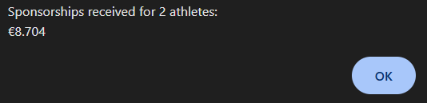

The list must remain visible after dismissing the message.

Display an appropriate message if there are no athletes in the list.

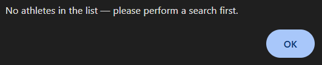

## Exercise 3

Build & validate a form using JavaScript  
Use JavaScript to implement the form validation.  
Adhere to all requested conventions and naming.

### FORM STRUCTURE

Open the starter file and build the form using Bootstrap as shown in the appendix on the last page.

Pay special attention to:

- Choose the correct types for the form fields
- Pay attention to the layout (1, 2 or 3 columns)
- Fill in default text where necessary (see appendix)
- Provide all fields with a label or a title

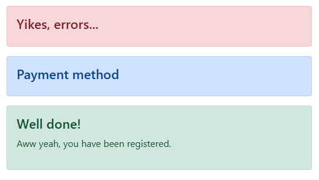

For the COUNTRY and PROVINCE dropdowns, set a default text and populate the list with a few countries and provinces.

In a right-hand column, display the ALERT messages. Within these tags, provide a title in an H4 tag and a P tag. The messages go in the P tag. Hide the alerts via the script.

### SCRIPT STRUCTURE

Provide sufficient comments in your script.

When clicking the button, trigger the `validateForm` function.  
In this function, validate all fields or call other functions as needed.

Use an `errors` array to store each message.

Hide the ALERT messages via your script.

The following fields may not be empty:

- FIRST NAME
- LAST NAME
- USERNAME
- ADDRESS
- COUNTRY
- PROVINCE

If a field is empty, display a message like “The first name field is required.”

#### Empty field validation

For checking an empty field, use a function `checkEmptyField` where you always pass 2 parameters: `field` and `message`. After checking, add the message to the `errors` array in this function.

#### Email address validation

To check whether it is a valid email address, use the function `validateEmail` where you pass one parameter: email address. This function returns a boolean.  
If the validation is invalid, add the message “Email address is incorrect.” to the `errors` array.

#### Password validation

For the password validation, check whether both fields are filled in. This may but does not have to be done via a function. A password must be longer than 7 characters and must always match the repeated password. Therefore, 4 messages can occur: 2 for empty fields, 1 if it is too short, and 1 when they are not equal to each other. Add the messages to the `errors` array.

Make sure to check the following:

- The username of the email address must meet the following criteria:
  - Must be at least one character long
  - May contain letters, numbers or underscores
  - May contain dots or hyphens, but not as the first character
- The domain of the email address must meet the following criteria:
  - Must start with a letter or number
  - May contain a dot or hyphen(s)

Are you working with regular expressions (RegEx)? Test them online at for example https://regexr.com.

#### Payment method validation

To check whether a payment method has been selected, use the function `validatePayment` where you pass one parameter: `field`.  
In this function, fill the P tag inside the blue (payment method) alert.

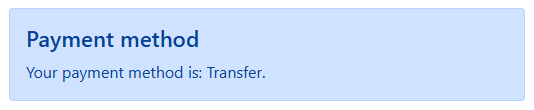

“Transfer” in the example is variable. This could also be “banking app”, “visa card” or “paypal” depending on what the user selected.

#### Postal code validation

For the postal code validation, use a function `validatePostalCode` where you pass one parameter: `field`. If the field is empty, display the message “The postal code field is required.”  
The value must also be greater than or equal to 1000 and less than 10000. So from 1000 up to and including 9999 is valid!  
Otherwise, display the message “The postal code value must be between 1000 and 9999.”  
Add these messages to the `errors` array.

Also check whether the terms and conditions have been agreed to. This is mandatory.  
Add a message to the `errors` array.

At the end, either display the `errors` array, or display the green and blue alerts together.

### ERRORS

Example: nothing filled in.

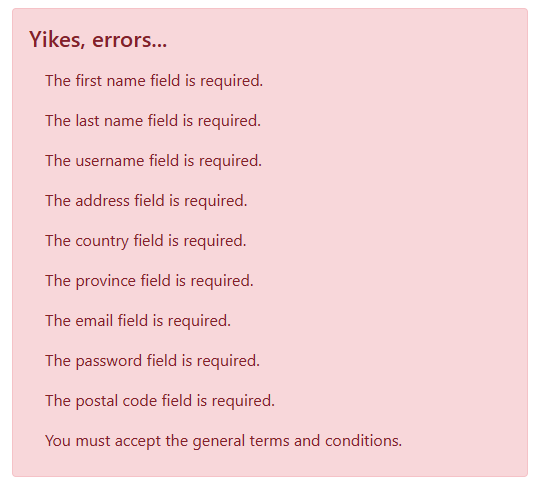

Error with password, address and postal code

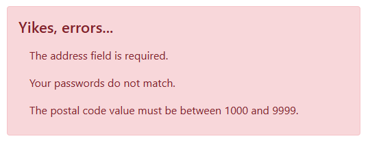

### SUBMITTED (fictitious)

Everything is in order!

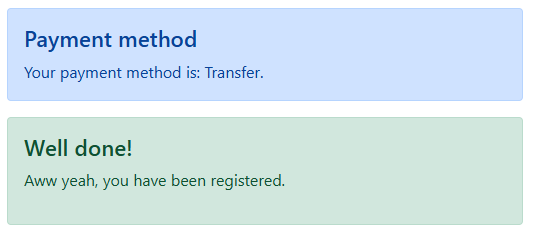

### Example form:

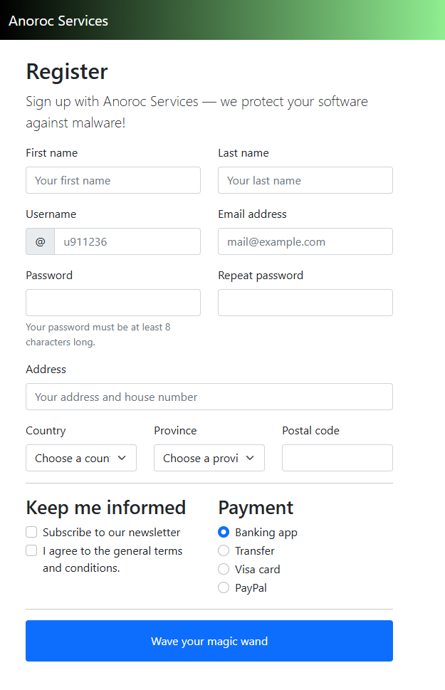
