# JavaScript conditional statements - Exercises

## Exercise 1

Determine whether a number is even or odd.  
Ask the user to enter a number.

To do this, calculate the remainder when dividing this number by 2. (Modulo!)

If the number is even, we display the message “this is an even number”,  
otherwise the message “this is an odd number” appears. We always show this in an alert box.

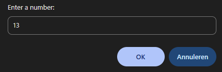
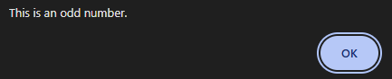
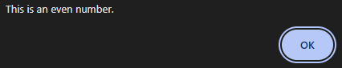

## Exercise 2

Ask the user to enter a number between 10 and 20.

Provide for 3 possible outcomes, each time outputting via an alert box:

- If the number is < 10, display the message “This number is smaller than 10.”.
- If the number is > 20, display the message “This number is greater than 20.”.
- If it is between 10 and 20, we calculate the square of this number and show this result to the user.

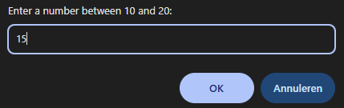
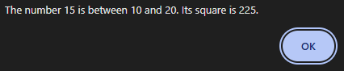
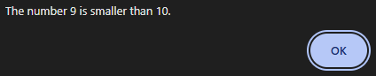
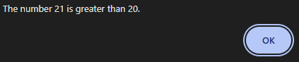

**Challenge 1:** when displaying the smaller or larger message, also include the number entered, for example: “The number 8 is smaller than 10”.

**Challenge 2:** look up how to use the mathematical function for exponentiation.

## Exercise 3

Solve the previous exercise (square) using the multiple selection structure (switch).

## Exercise 4

Write a program that calculates how much someone has to pay for a cinema ticket.

The program asks the user for their age and then decides on the following grounds:  
a. Younger than 5: free  
b. Between 5 and 12: half price  
c. Between 13 and 54: full price  
d. 55 and older: free

Show the result on the screen via an alert box.

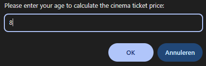
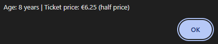

**Challenge:** display an appropriate message if the user does not enter a valid age. For example, they press the plus sign instead of the number 9.

## Exercise 5

Have the user enter 3 numbers. (Separately)

Indicate in an alert box which is the smallest, largest and middle number.

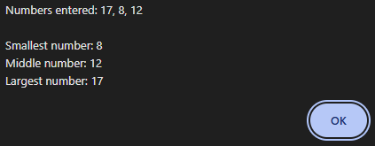

## Exercise 6

Calculate your weight on another planet.

To do this, open the starting file  
opdracht_planeten_start.html.

Moon => 0.166  
Jupiter => 2.36  
Mars => 0.39  
Venus => 0.9  
Neptune => 1.12

Ask the user to enter their weight via a prompt and then give the user the following choice:  
A. Moon  
B. Jupiter  
C. Mars  
D. Venus  
E. Neptune

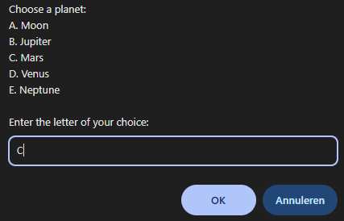
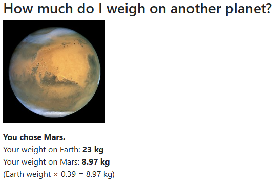

Display the message “Wrong choice” or “You chose...” in the div #myWeigth.

**Challenge 1:** ensure that you don’t have to enter capital letters only, but that it also accepts the lowercase letter “a”, for example.

**Challenge 2:** can you also change the question mark image to the correct image depending on the choice?  
TIP: look up how to change the source of an image!

**Challenge 3:** look up how to round to 2 decimal places.
