# JavaScript iterations - Exercises

## Exercise 1

Request a number. Display the same number of plus signs on the screen.

Example: If the number is 5 -> +++++  
If the number is 10 -> ++++++++++

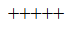

## Exercise 2

Ask the user for a number. As long as the number is less than 100, add 12 to it. Display the new number each time on the screen.

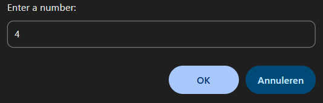
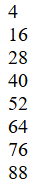

## Exercise 3

In a nature park there are 50 lions. The number increases annually by 15%. Determine how long it takes until there are more than 1000 lions.

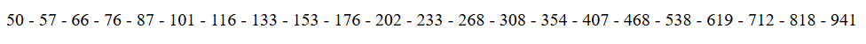

Above, show the number of lions; below, also show the number of years.

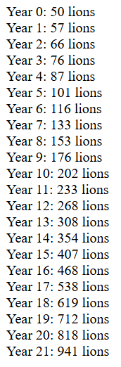

## Exercise 4

For a raffle, numbered tickets are sold. The only prize is a computer worth 1899 Euros. The first 5 tickets are sold at a price equal to the ticket number; for subsequent tickets, the price is always 6 Euros. Write a program that calculates how many tickets must be sold before a profit is made.

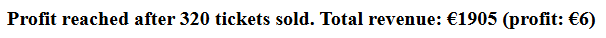

## Exercise 5

A program reads in n results. If a number less than 50 is entered, the message “Oh dear, will the next one be better?” appears; otherwise, the text “keep it up” appears on the screen. After the n-th number, the message “enough tries, your turn is over!” appears on the screen and the average of the results is displayed.

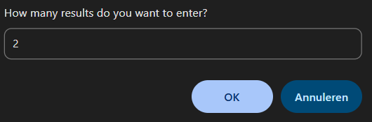
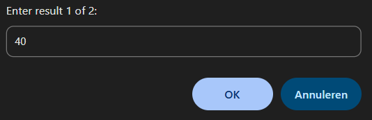
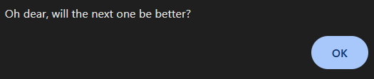
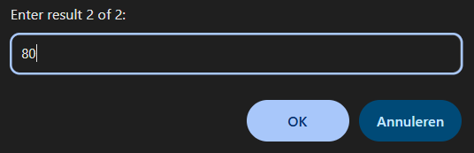
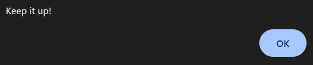
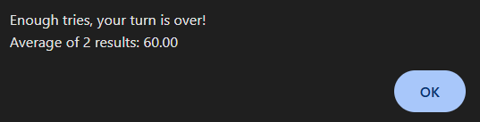

## Exercise 6

During a police speed check, it is checked whether the maximum speed of 50 km/h is exceeded. The fine consists of a fixed portion of 125 Euros and a variable portion of 25 Euros for every km driven over the limit. Calculate this variable portion by reducing the measured speed in a while loop until it reaches the value 50.

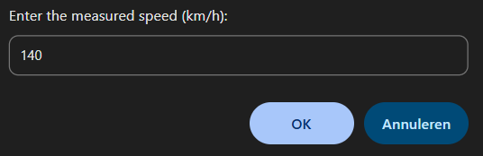
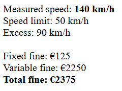

## Exercise 7

Display the ten times table on the screen using the while() loop.

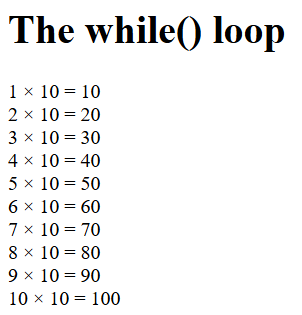

## Exercise 8

Display the ten times table on the screen, but now using the for() loop.

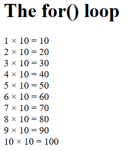
