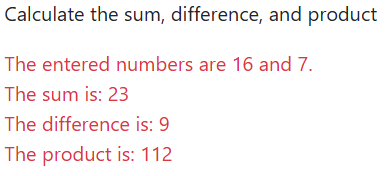
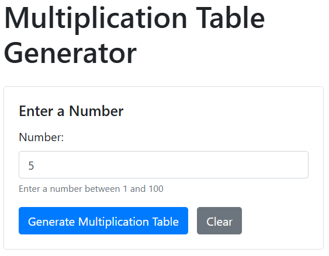
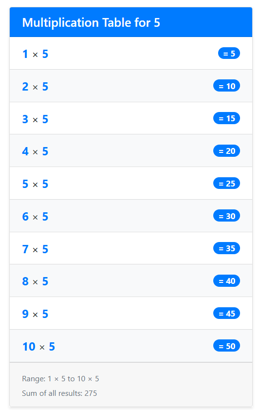
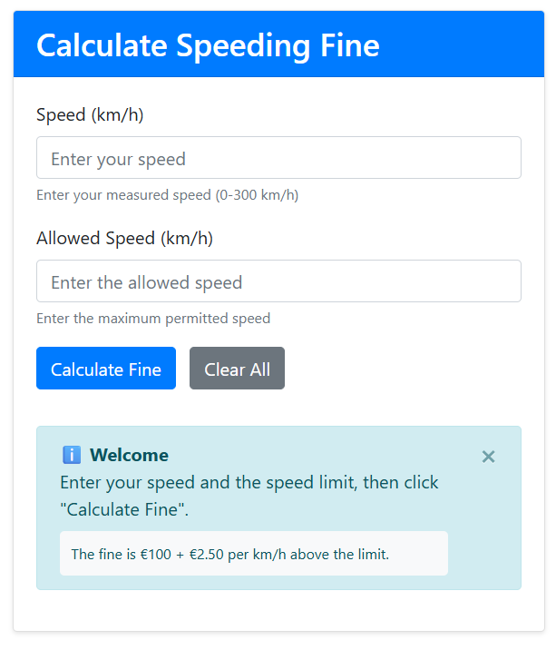
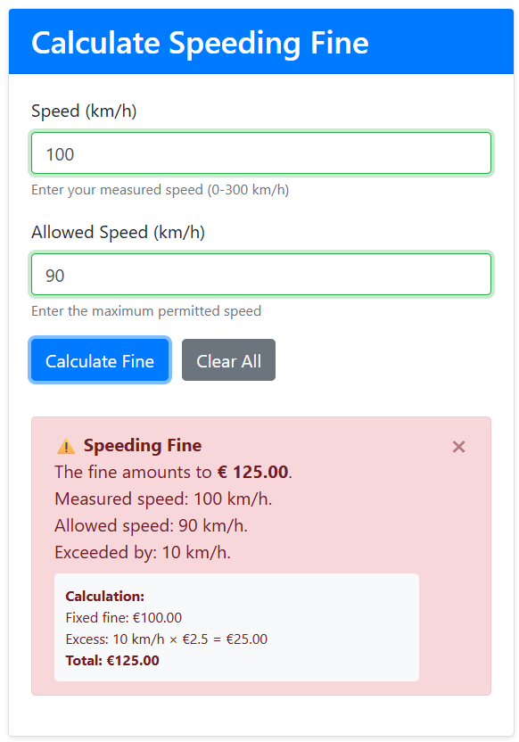
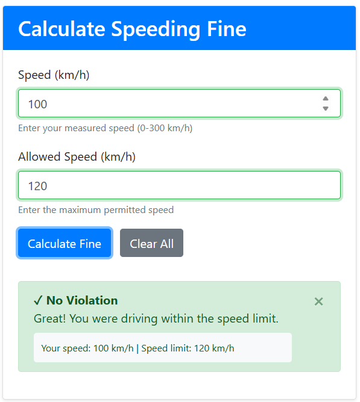

# JavaScript functions - Exercises

## Exercise 1

Create three different functions: calculateSum, calculateDifference, and calculateProduct.  
Each function takes two parameters: number1 and number2.  
Ask for these two numbers using a prompt box.  
Call the three functions and display the result in a div.

## Exercise 2

Create a function checkMax(number1, number2). The return value of this function is the largest number.  
Ask the user for two numbers and display the largest number.  
Write this function as an arrow function.

**Challenge:** Look up an existing JavaScript function you can use for this.

## Exercise 3

Create a form with a button "Enter name". When the button is clicked, the function "enterName" is called. The function displays a prompt box asking for a name.  
Display this name in a text field of the form.

## Exercise 4

Create a form with 3 text fields and a button. When the button "Merge" is clicked, the function "merge" is called. This function merges the input from text field 1 with that from text field 2.

## Exercise 5

Use the script from the iteration exercise to display the multiplication tables for a number.  
Write a function table that receives a number. Use Bootstrap's List groups to display the multiplication tables.

## Exercise 6

Calculate the speeding fine.

The fine always consists of a fixed amount of € 100 and € 2.5 per km/h you drove above the maximum permitted speed.

When the user clicks the button, you trigger the issueFine function.

You read the values from the text fields speed and permittedSpeed.  
With these values you calculate the speedOverLimit.

Display the following message in a div "fine".  
Use Bootstrap's alert element for this.  
Depending on the outcome, use different classes.

**Challenge:** display an appropriate message if the speed or permittedSpeed text field has not been filled in.  
Ensure the rest of the function is no longer executed.
