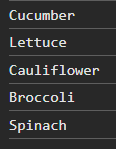
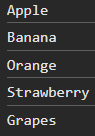

# JavaScript arrays - Exercises

## Exercise 1

Create an array with first names of your classmates (at least 5). Then perform the following functions.

1. Write to the screen how many elements the array contains.
2. Write the first, third and fifth element from the array to the screen.
3. Sort the array in alphabetical order and write it to the screen.
4. Use prompt() to ask for an additional name. Add it to the array using an array function and
   write the result to the screen.
5. Join the array into a string and display the string on the screen.

## Exercise 2

Create an array with first names of your classmates (at least 5).  
Filter the array so that only names longer than five characters remain and print them on the screen.

**Challenge:** can you also solve this using an arrow function.

## Exercise 3

Create an array with ten scores out of 100. Generate random numbers between 40 and 100.  
Use the mapping method (map) to convert these scores to a scale out of 20 and print them on the screen. Ensure the scores out of 20 are integers (rounding).

## Exercise 4

Create two arrays, one array with five different vegetables and one array with five different types of fruit.

Print the vegetable array using a conditional loop, print the fruit array using a bounded loop. Use the length of the array for this.

Print the values of these arrays to the console.

