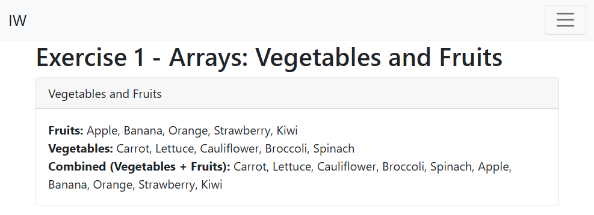
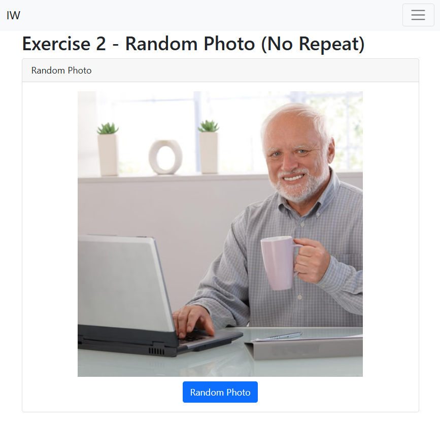
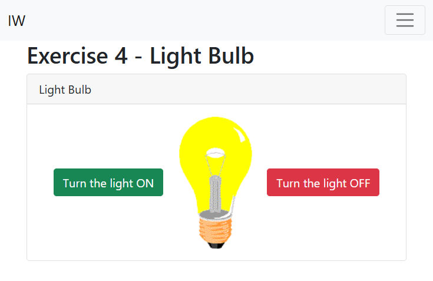

# JavaScript DOM - Exercises

## Exercise 1

Create two arrays, vegetables and fruit, and populate them with a number of items.
First, print both arrays separately with a comma and a space as separators.
Then merge both arrays and print them as a string.

## Exercise 2

Create a web application that displays a random photo when you click a button. In the img folder you will find three images you can use. Ensure you do not show the same photo twice!

## Exercise 3

Create a web application that allows you to filter text using three buttons.

When you click the 'Change all titles' button:

- change all headers to dark red
- underline all headers
  When you click the 'Change all subtitles' button:
- change all elements with the class 'subtitles' to dark blue
- change all elements with the class 'subtitles' to the font 'Verdana'

When you click the "Change everything" button:

- change the titles and the subtitles

## Exercise 4

Create a web application with an image and two buttons. When you click the 'Turn the light on' button, change the image to the correct light bulb, and vice versa.

