# JavaScript events - Exercises

## Exercise 1

Create a web application that allows you to add products to a shopping cart.
When you click the 'Add' button, you add the product to an unordered list.
If the shopping cart is empty, the list has one item with the value 'No products found'.

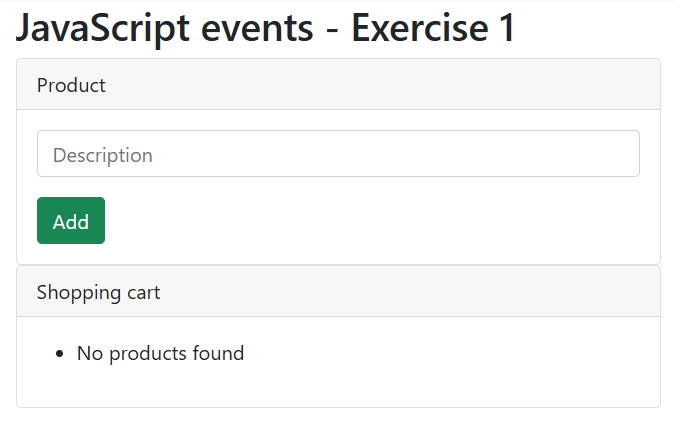
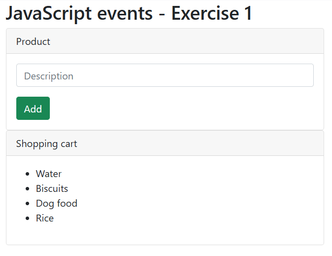

## Exercise 2

Now ensure that for each product you can enter a quantity and a price. Once the product is in the shopping cart, show the total amount per product and the overall total.

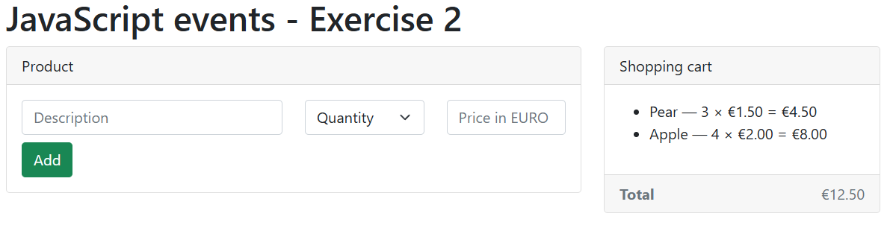

## Exercise 3

Now ensure that you can enter different discount codes. When the user types 'Nick', 'Steve' or 'Michael', a discount of 20% will automatically be applied to the total. Be careful that you can only use a discount code once!

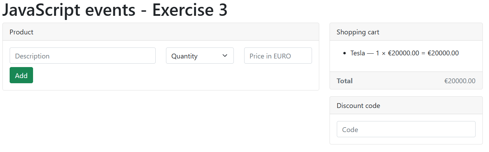
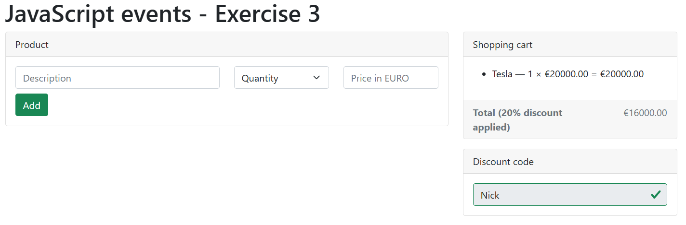

## Exercise 4

Create a form that automatically shows the result without using a button.
The user can enter their first name, last name and their favourite colour. With each change to these fields, the result updates automatically.

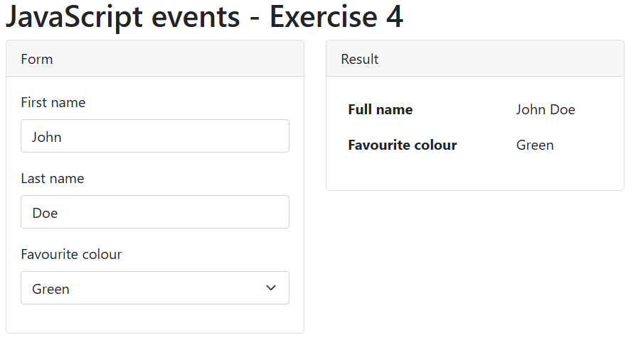

## Exercise 5

Create a web application that keeps track of which buttons you pressed at what time. When you press a button, you add a new item to the ordered list.

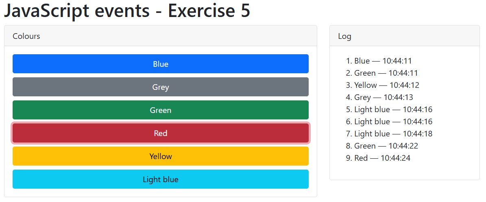

## Exercise 6

Create a game where a player must try to guess how many times a six will be rolled by 12 players.

Open the starting file `exercise_6_start.html` for this.

We create 12 cards (Bootstrap) with a grey background (bg-secondary) and each with its own id player1, player2....

```html
<div class="col-md-3 mb-3">
  <div class="card text-white bg-secondary" id="player1">
    <div class="card-body">
      <h5 class="card-title">Player 1</h5>
    </div>
  </div>
</div>
```

Can you achieve this using Emmet? Try it first before copying and pasting!

- Here is a starting point => `div.col-md-3.mb-3\*12>div.card...`

When the user clicks the PLAY button, you trigger an anonymous function that starts the game.
When the user clicks the RESET button, you trigger a `reset()` function.
Both functions are created using addEventListener.

When the anonymous function starts the game, we first call the `reset()` function.
Then we ask the player how many times they think a six will be rolled.

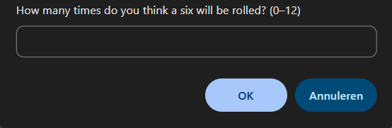

We ensure that 12 dice rolls are performed.

If a six is rolled, you change the background colour from grey to green (bg-success)!
In the div with alert-info, we indicate how many players rolled a six.

Also provide a message indicating whether the player guessed the number correctly or not.

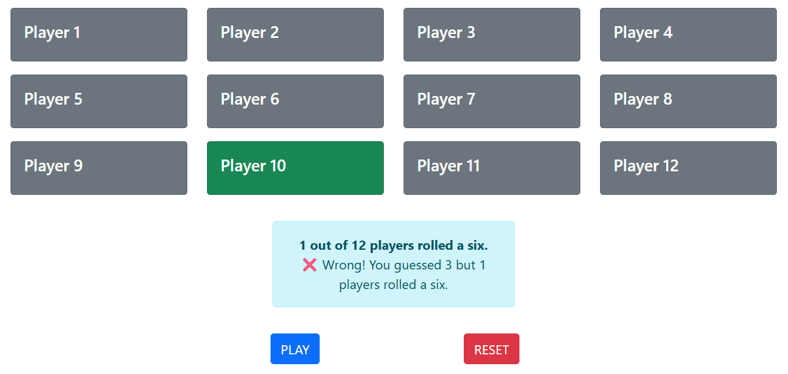
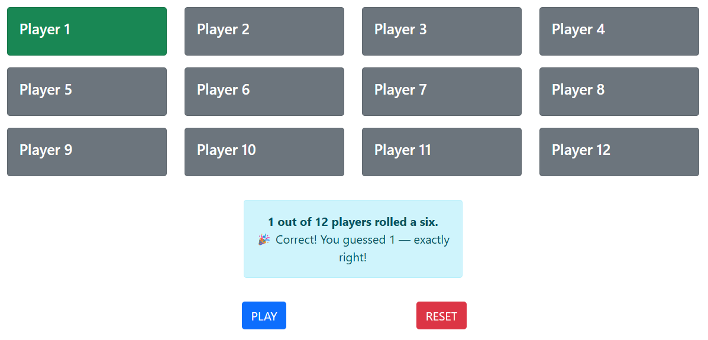

The `reset()` function ensures that the 12 cards get their grey background colour back and that the message in the div is empty again.

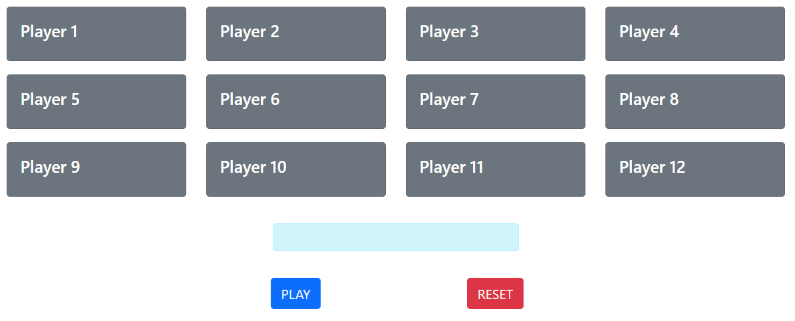
