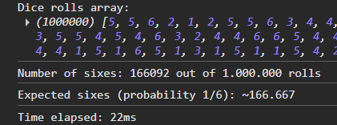
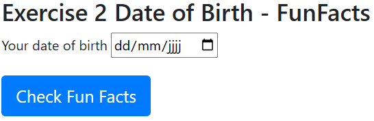
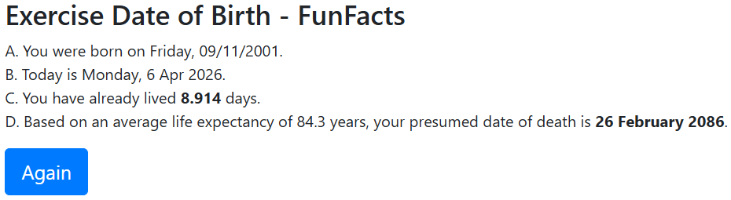
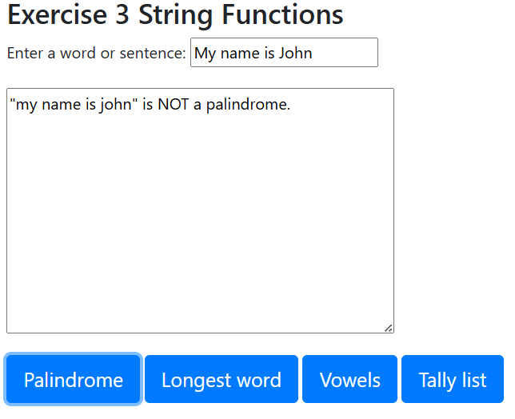
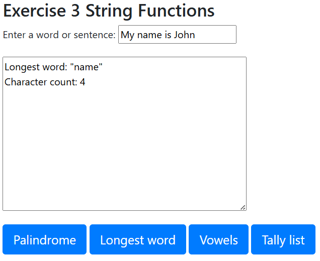
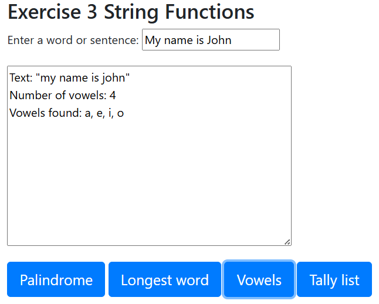
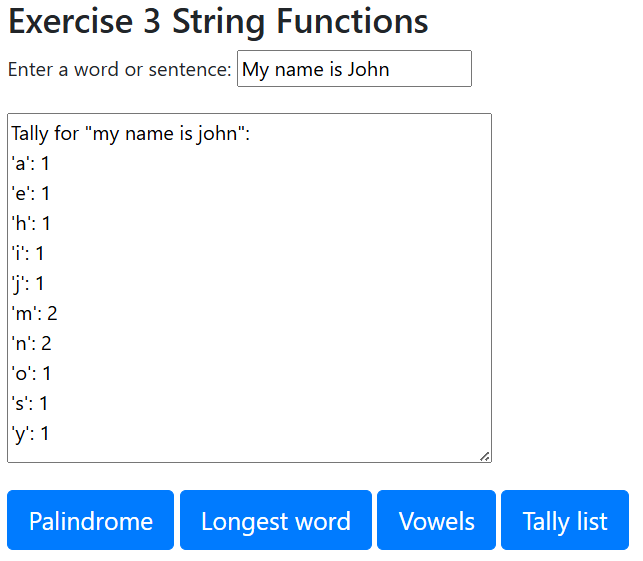

# JavaScript objects-built-in - Exercises

## Exercise 1

LEARNING OBJECTIVES: applying date & math objects, arrays, conditions, events, functions.

Write a script that, when the page loads, displays the difference in milliseconds between the start of the script and the end of the script.
TIP: calculating the difference between two dates/times is best done in milliseconds!

In the middle of the script, populate an array with 1,000,000 random dice values.
Count the number of sixes.

Then display the array, the number of sixes and the time difference in milliseconds via the console.

## Exercise 2

LEARNING OBJECTIVES: applying date, localStorage, location & history objects, events, functions.

Enter your date of birth and display some Fun Facts on a subsequent page.

Open the starting files exercise_2_dob_start.html and exercise_2_funfacts_start.html for this.

@Page exercise_2_dob.html

When the page loads, call the function maxDatum() which adds the “max” attribute to the date of birth input element. Ensure this is in the format yyyy-mm-dd!
So for example max=”2020-03-23”.
Create a function storeAndGo() that we call when the button is clicked.
In this function, we save the date of birth via localStorage with key “gbdate” and the date of birth as the value.
Using the location object, we ensure the page forwards to exercise_2_funfacts.html.

@Page exercise_2_funfacts.html

When the page loads, call the function funFacts(). This returns 4 full sentences with a number of calculations of date values. Ensure an exact representation of the date format.

First of all, this function ensures that “gbdate” is read from localStorage and that only “gbdate” is removed from localStorage.

1. First, display the date of birth: “You were born on Monday 22/10/1984”.
2. Then display the current date: “Today is Monday 23 Mar. 2020”.
   TIP: do not store the months in an array, but look up via Internationalization DateTimeFormat!
3. Display the number of days this person has already lived.
   TIP: calculating the difference between two dates is best done in milliseconds!
4. Display the presumed date of death based on the average life expectancy. For men this is 80.1, for women this is 84.3 (2018 figures).
   For now, you do not need to take gender into account. (Choose one value M or F)

**Challenge 1:** ensure that the form can also indicate whether it is a man or a woman. Based on this, use the correct average.

## Exercise 3

LEARNING OBJECTIVES: applying methods on the string object, arrays, iteration, events, functions.
Open the starting file exercise_stringfunctions_start.html for this.

For this exercise, create 4 different functions that we call when clicking the different buttons.

The text coming from the text field may first be converted to lowercase.

- `isPalindrome`: Checks whether a word/sentence is a palindrome.
- `findLongestWord`: Displays the longest word and returns the number of characters.
- `countVowel`: Displays the number of vowels in the word/sentence.
- `tallyCharList`: Tallies the number of identical characters in the word/sentence.

