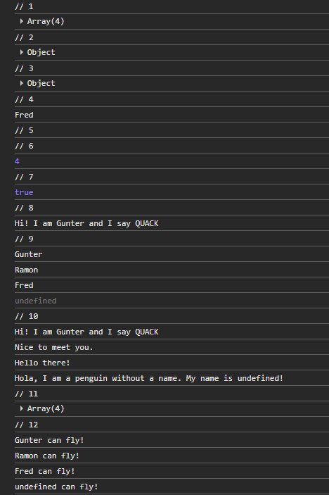
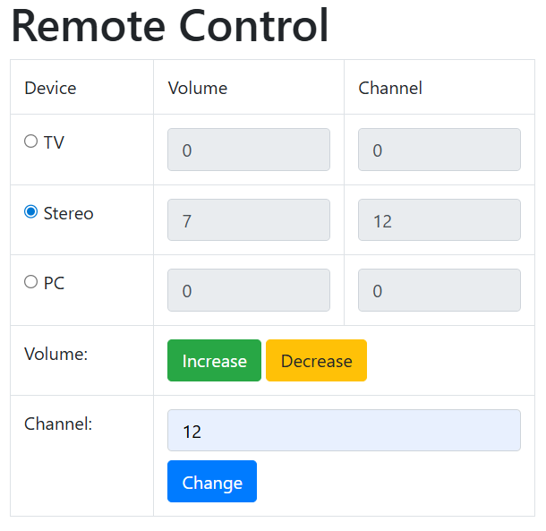
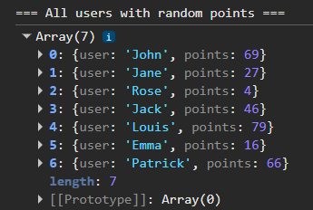
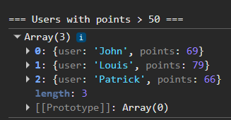

# JavaScript objects - Exercises

## Exercise 1

Create 3 penguins using an object literal. Give them the names gunter, ramon and strangePenguin.  
They have the following properties. Note that the last one has no name, but character!

1. - name: "Gunter"
   - origin: "Adventure Time"
   - canFly: false

2. - name: "Ramon"
   - origin: "Happy Feet"
   - canFly: true

3. - character: "Penguin McPenguin"
   - origin: "Donald Duck"
   - canFly: true

Also give them a method sayHello. This writes the following to the console:

- gunter => “Hi! I am <name> and I say QUACK”
- ramon => “Nice to meet you.”
- strangePenguin => "Hola, I am a penguin without a name. My name is <name>!"

The fourth penguin, fred, you create using an object constructor function (blueprint).  
Name = Fred, origin = Sitting Ducks, canFly = true

Name the function Penguin and as parameters you can pass name, origin & canFly.  
Also add the method sayHello to fred that prints to the console “Hello there!”.

Perform the tasks below and always log them in the console.

1. Create a new variable penguins with a list (array) containing the objects
2. Retrieve the first object in the array and print all properties and methods of this object.
3. Create a new variable anotherPenguin and set it equal to the second penguin in the array.
4. Print the name of the last one. Ensure the code still works if there are more or fewer objects in the array.
5. We have one strange penguin. Add it to the end of our array!
6. Show the length of our array.
7. For the first penguin, set the canFly property to true and print it.
8. Call the sayHello method for the first penguin in the array!
9. Write a loop to retrieve each penguin and print the names to the console.
10. Write a loop to execute the sayHello method for each penguin.
11. Write a loop to add a new property to each penguin: namely numberOfFeet and give all of them the value 2. Display all objects in the console.
12. Write a loop and print a message to the console for each penguin that can fly (canFly = true) with <name of the penguin> + " can fly!" Display nothing if it cannot fly!



## Exercise 2

1. Create the following HTML page. The values of the radio buttons are tv, stereo or pc.
2. Define an object “device” with properties volume and channel using a constructor function.
3. Create 3 instances of this object: tv, stereo and pc. These names must match the values of the radio buttons! The initial values of volume and channel are 0.
4. The fields for volume and channel are not editable.
5. Create a function setValues(). This function sets the object values in the 6 fields.  
   For example, in text field txtTvVolume, the value of the volume for the tv goes there (tv.volume).  
   We also call this function when the window loads. Everything thus gets the value 0.
6. Create a function changeVolume(). This function is called by the “increase” and “decrease” buttons. You can use “this” to check via the id (this.id) which button was clicked.  
   This function first checks which radio button is selected. Then you increase or decrease the value of the volume property of tv/stereo/pc for the selected radio button.
7. Use the eval function (look this up!) to increase/decrease the volume by 1.  
    For example:
   ```javascript
   let objectName = “tv”; // tv must match the value of the selected radio button
   eval(objectName.value + “.volume++”);
   ```
   At the end, call the setValues() function again.
8. Create a function changeChannel().
   Use the same approach as above. Instead of increasing/decreasing by 1, the channel is set equal to the entered text field.



## Exercise 3

Create an array arrUsers with 7 objects inside.
This object has 1 property user. This contains the names of the users. (Enter them yourself!)
Using the map method, give each object in the array a new property points and automatically fill it with a random value from 0 to 100.
Display the arrUsers array in the console.



Using the filter method, extract all objects where the points are greater than 50.
Store these in the array arrSelected and display them in the console.



Using the reduce method, calculate the sum of all points in arrSelected.
Display the average via a sentence in the console.
Note: ensure that when we expand or reduce the objects at the beginning, the average is still correct!

```

```
